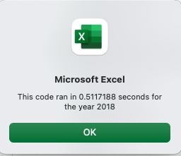
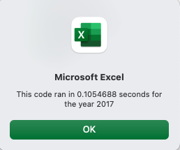
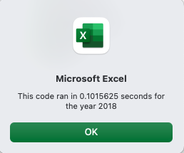
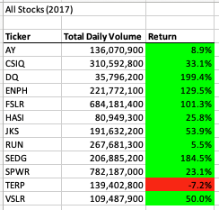
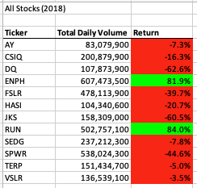

# Stock Analysis

## Overview of Project
The purpose of this project is to analyze stock data. We want to find the total daily volume and yearly return for each stock. Daily volume is the total number of shares traded throughout the day; it measures how actively a stock is traded. The yearly return is the percentage difference in price from the beginning of the year to the end of the year.  Our starting point is an Excel file with stock data for 12 different stocks.

For this assignment, we want VBA code that executes fast and is efficient so that it can be applied on the entire stock market. We are refactoring prior code and measure the performance of the VBA script. 

## Results

### Performance results with the original script

This is the [original script](Resources/AllStockAnalysis.vba).

The original script loops through the list of stock tickers and iterates over the rows in the table for each stock ticker. This is inefficient as there are multiple iterations over the rows. While the script might run for a small number of stocks, there would be significant performance issues when the script is run over the entire stock market.

The performance of the original script for stock analysis in 2017 

The performance of the original script for stock analysis in 2018 

### Performance results with the refactored script

This is the [refactored script](Resources/AllStockAnalysisRefactored.vba).

While the result of the stock analysis have not changed, the refactored script has much better performance due to the refactoring. 

I have refactored the original script to loop through the list of stock tickers once and store the values for volume and performance in an array as we are going through the rows. This increases the performance of the script significantly as we don't have multiple loops over the rows. 

As we can see from the following performance data, I have accomplished a nearly 5x improvement in performance compared to the original script.

The performance of the original script for stock analysis in 2018 

As we can see from the output in the table, the results of the stock analysis using the refactored script have not changed. 

The stock analysis result of the original script for stock analysis in 2018 

## Summary

### Advantages and Disadvantages of Refactoring Code
The advantages of refactoring code can be summarized as follows:
- Better comprehensibility facilitates maintenance and the extendibility of the software	
- Restructuring the source code is possible without altering the functionality	
- Improved legibility improves the comprehensibility of the code for other programmers	
- Removed redundancies and duplications improve the effectiveness of the code	
- Clean code with shorter, self-contained methods is characterized by better testability	 

The disadvantages of refactoring code can be summarized as follows:
- Imprecise refactoring could introduce new bugs and errors into the code
- There is no clear definition of “neat code”
- An improved code is often difficult for the customer to recognize, since the functionality stays the same, i.e. the benefit is not self-evident
- In the case of larger teams working on refactoring, the coordination effort required could be surprisingly high

### Advantages and Disadvantages of the original and refactored VBA script
The original VBA script was a quick and easy way to prototype and write the simple logic for a single ticker symbol and extend it to a list of ticker symbols. It allowed us to prove the concept that we can retrieve the desired stock analysis data from the data that was provided.  However, the performance of the script was an issue and we would have run into significant performance issues when running the script over the entire stock market.

The refactored VBA script was much faster by going through the rows only once and therefore significanlty improved performance. This would allow us to run the script over the entire stock market. The result of the stock analysis did not change and therefore we did not loose any business funcionality. One could argue that the refactored code is easier to read and therefore also easier to maintain. 